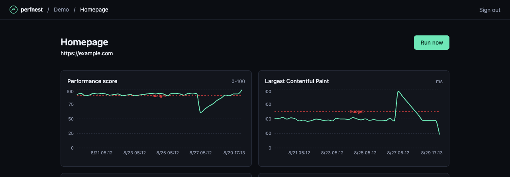

<div align="center">


**perfnest** — the Lighthouse trends dashboard Calibre, SpeedCurve, and DebugBear charge
$75–$1,500/month for. Scheduled and CI-triggered Lighthouse runs, Core Web Vitals trend
charts, and per-metric performance budgets that alert Slack (or email) the moment a deploy
regresses — self-hosted, no per-seat fee, no real-user tracking script on your site.

[](https://github.com/Laaaaksh/perfnest/stargazers)
[](https://github.com/GoogleChrome/lighthouse)

[](https://github.com/Laaaaksh/perfnest/actions/workflows/ci.yml)
[](https://github.com/Laaaaksh/perfnest/releases)
[](LICENSE)
[](package.json)
[](#install)

**[Install](#install) • [Usage](#usage) • [CI integration](#ci-integration) • [Configuration](#configuration) • [Changelog](CHANGELOG.md) • [Contributing](CONTRIBUTING.md) • [License](LICENSE)**

**[Code of conduct](CODE_OF_CONDUCT.md) • [Contributing](CONTRIBUTING.md) • [License](LICENSE) • [Security](SECURITY.md)**

</div>

## What it does

- Runs Lighthouse on a schedule or on-demand (via webhook), against mobile "Slow 4G, 4x CPU"
  or desktop "Dense 4G, no throttle" presets — Lighthouse's own documented lab profiles, not
  invented ones.
- Charts Performance score, LCP, TBT, CLS, and FCP per page over time, so a regression is a
  visible line, not a number you have to remember from last week.
- Fires a Slack, generic webhook, or email alert the moment a run crosses a per-metric budget
  you set per page.
- Fails a deploy pipeline on a budget breach with one `curl` call or a bundled Node script —
  no dashboard-clicking required to gate a release.
- Shares a read-only public trends page per project, the way a status page shares uptime.
- Runs as two Docker containers (the app, Postgres) — no paid infrastructure, no third-party
  script on the pages you're testing.

## Demo



The chart above is real output from a running Perfnest instance seeded with `npm run seed`:
a steady ~92 performance score, a sharp drop to 61 after a deploy (`a1b2c3d`), and the LCP
chart crossing its 2,500ms budget line at the same run — the exact regression-plus-alert
scenario this tool exists to catch.

## Requirements

- Docker and Docker Compose (the supported way to run this)
- ~1GB of free memory for headless Chromium — Lighthouse runs a real browser, not a simulation
- Ports 3000 (app) and 5432 (Postgres, only if you run the `db:migrate:dev` / integration-test
  workflow from [CONTRIBUTING.md](CONTRIBUTING.md)) free on the host — see below to remap either

Running from source instead of Docker also works, but you're then responsible for Postgres
16+, Node.js 20+, and a Chromium binary on `$PATH` (see `CHROME_PATH` in
[Configuration](#configuration)).

## Install

```bash
git clone https://github.com/Laaaaksh/perfnest.git
cd perfnest
cp .env.example .env   # set ADMIN_PASSWORD and AUTH_SECRET, at minimum
docker compose up -d
```

The first build installs headless Chromium inside the app image for Lighthouse to drive —
that's most of the ~15 minutes a cold, uncached first build takes; later builds are fast.

Open `http://localhost:3000` and sign in with the `ADMIN_PASSWORD` you set. Perfnest is
single-admin software — there are no user accounts, just one shared password for whoever
operates this instance.

If port 3000 (or 5432 for Postgres) is already taken on your host, set `HOST_PORT` (or
`DB_HOST_PORT`) in `.env` to remap it, e.g. `HOST_PORT=3001 docker compose up -d`.

## Usage

1. Create a project (a project groups the pages you want to watch — one per site is typical).
2. Add a page: a URL, a label, mobile or desktop, and a check interval.
3. Set a budget on any metric (e.g. LCP ≤ 2500ms, performance score ≥ 90) and add a Slack
   webhook or email address as an alert channel.
4. Click **Run now**, or wait for the scheduler — it checks every minute for pages whose
   interval has elapsed and runs them one at a time.

Want to see it with real data before wiring up your own site? `npm run seed` populates a demo
project with 10 days of synthetic run history, including the regression shown in the demo
screenshot above.

## CI integration

Every project has an API token and every page a URL like:

```bash
curl -sf -X POST http://localhost:3000/api/pages/<pageId>/runs \
  -H "Authorization: Bearer <project-api-token>" \
  -H "Content-Type: application/json" \
  -d '{"deployId": "'"$GITHUB_SHA"'"}'
```

That triggers an on-demand run and returns its metrics and budget status as JSON. To fail a
pipeline step on a budget breach, use the bundled helper instead of hand-rolling `jq`:

```yaml
# .github/workflows/deploy.yml, after your deploy step
- name: Check performance budget
  run: node scripts/check-budget.mjs
  env:
    PERFNEST_BASE_URL: https://perf.yourcompany.com
    PERFNEST_PAGE_ID: ${{ vars.PERFNEST_PAGE_ID }}
    PERFNEST_TOKEN: ${{ secrets.PERFNEST_API_TOKEN }}
    PERFNEST_DEPLOY_ID: ${{ github.sha }}
```

It exits non-zero (failing the job) when the run fails or any budget is breached. Both the
`pageId` and the token are shown on the project page in the dashboard.

## Configuration

All configuration is environment variables — see [`.env.example`](.env.example) for the full,
commented list. The two you must set are `ADMIN_PASSWORD` (the shared admin password) and
`AUTH_SECRET` (a random 32+ character string signing session cookies — `openssl rand -base64
32`). Email alerts need your own SMTP relay (`SMTP_HOST`/`SMTP_PORT`/`SMTP_USER`/`SMTP_PASS`/
`ALERT_EMAIL_FROM`) — Perfnest does not bundle an email provider, so Slack or generic webhook
alerts are the zero-setup option.

## Metrics

Perfnest tracks Performance score, LCP, CLS, and FCP directly from Lighthouse's lab audits. It
does **not** track a real INP value: INP is fundamentally a field metric that requires actual
user interactions, which a synthetic Lighthouse run can't produce (real-user monitoring is a
deliberately different, heavier feature — see [Scope](#scope) below). Total Blocking Time,
Google's own documented lab-mode proxy for responsiveness, stands in for it instead.

## Scope

v1 is synthetic/lab testing only, run from wherever you deploy it — no real-user monitoring
and no multi-region synthetic probes. It runs Lighthouse/Chromium exclusively (no Firefox or
Safari lab testing). If you need field data on real traffic or testing from multiple
geographic locations, this isn't that tool; it's the trends-and-budgets layer on top of the
same open-source Lighthouse engine the paid tools also build on.

## Changelog

Notable changes per release live in [CHANGELOG.md](CHANGELOG.md).

## Contributing

Contributions are welcome. See [CONTRIBUTING.md](CONTRIBUTING.md).

## Security

Found a security issue? Please report it privately — see [SECURITY.md](SECURITY.md).

## Star this repo

If Perfnest saves you a Calibre or SpeedCurve invoice, [leave a star](https://github.com/Laaaaksh/perfnest/stargazers) — it helps other people find it.

<a href="https://www.star-history.com/?repos=laaaaksh%2Fperfnest&type=date&legend=top-left">
 <picture>
   <source media="(prefers-color-scheme: dark)" srcset="https://api.star-history.com/chart?repos=laaaaksh/perfnest&type=date&theme=dark&legend=top-left" />
   <source media="(prefers-color-scheme: light)" srcset="https://api.star-history.com/chart?repos=laaaaksh/perfnest&type=date&legend=top-left" />
   
 </picture>
</a>

## License

MIT - see [LICENSE](LICENSE).
